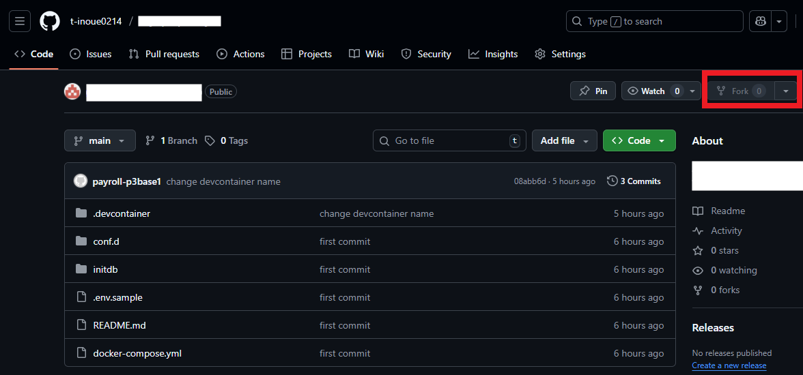
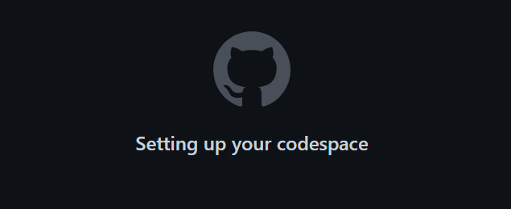
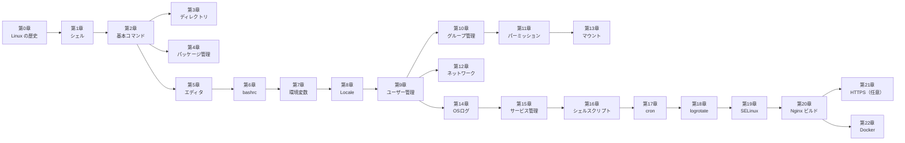

# Linux Hard Way — Codespaces で学ぶ Linux 基礎

環境構築不要！ブラウザだけで学べる Linux ハンズオン入門講座へようこそ。

このリポジトリは、**GitHub Codespaces** を使って、新卒エンジニアが Linux の基礎を **実体験を通じて** 学べるように設計されています。

> **⚠️ 学習上の重要ルール**
> コマンドの正確な仕様は必ず [Debian 公式ドキュメント](https://www.debian.org/doc/) や `man コマンド名` で確認してください。
> AI からの回答であっても、**必ず公式情報と照らし合わせる癖** をつけてください。

---

## この講座を完了すると何ができるようになるか

- Linux の基本コマンドを使いこなし、ファイル・プロセス・リソースを操作できる
- bashrc をカスタマイズして自分専用の開発環境を構築できる
- ユーザー・グループ・パーミッションを設計・管理できる
- service/systemd でサービスを登録・管理できる
- OS ログ（syslog, journald）を読んでトラブルシューティングできる
- Nginx をソースコードからビルドして手動でセットアップできる
- **「コンテナの中身を理解できるエンジニア」として Docker の価値を実感できる**

---

## 💻 1. 開発環境 (Development Environment)

この勉強会では **GitHub Codespaces** を使用します。

面倒な環境構築は不要です。ブラウザさえあれば、すぐに学習を始められます。

1. **GitHubにログイン** してください（アカウントがない場合は作成してください）。

1. このリポジトリをフォークするため、右上の`fork`をクリックする。

    

1. `Create fork`ボタンをクリックして、フォーク（自分のアカウントにコピーして新しいリポジトリを作成）する。

    

1. `Codespace`を起動するため、`Code`タブに移動し、右上にある緑色の`code`のプルダウンメニューを開き、`Codespace`タブを開き、`Create codespace on main`をクリックする。

    

1. `Codespace`の生成にはしばらく時間がかかるため、しばらく待つ。

    

1. `VSCode`が起動するが、画面左下が`リモートを開いています...`の間は待つ。

    

1. 画面左下が`Codespace`になった場合は、`Codespace`が起動完了しました

    

環境が立ち上がったら、左側のファイル一覧から `chapter-00/` フォルダを開いてください。

> **💡 環境の自動セットアップについて**
> Codespace 起動後、バックグラウンドで学習用ツール（vim, emacs, rsyslog 等）が自動インストールされます。
> 完了まで数分かかることがあります。ターミナルにセットアップ完了メッセージが表示されてから学習を始めてください。

### Codespaces 利用上の注意

- `Github`の`Codespaces`を利用する。`Codespaces`は設定によってはコストがかかるため、[Codespace の利用上の注意](./CODE_SPACES_SERVICE.md) はよく確認すること。
- コストをかけないためにも、セキュリティの意味でも、使い終わったら [停止方法](./CODE_SPACES_SERVICE.md#3-停止方法) に従って停止することを推奨する。

---

## 🚀 2. 学習の始め方

1. **Codespaces を起動**
    - フォーク済みの自分のリポジトリで、`Code` タブ → `Codespaces` タブ → `Create codespace on main` をクリックする。
    - 起動手順の詳細は [1. 開発環境](#-1-開発環境-development-environment) を参照。

1. **環境の準備を待つ**
    - ブラウザで VS Code が起動する。
    - 初回は Debian Linux のセットアップのために数分かかる。
    - ターミナルにセットアップ完了メッセージが表示されるまで待つ。

1. **学習スタート！**
    - 左側のファイル一覧から `chapter-00/` フォルダを開く。
    - `README.md` をクリックして開き、解説を読みながら進める。
    - `README.md` を右クリックして「プレビューを開く (Open Preview)」を選ぶと読みやすくなる。

---

## 📚 3. この講座で学ぶこと

この講座は **23章構成**です。`chapter-00/` から順番に進めてください。

| 章 | タイトル | 形式 | 学ぶ主な内容 |
|:--|:--|:--|:--|
| **第0章** | [Linux の歴史・ディストリビューションとは](./chapter-00/README.md) | 説明 | Unix の歴史、ディストリ比較、オープンソース |
| **第1章** | [シェルの種類と選び方](./chapter-01/README.md) | 説明+実習 | bash / zsh / fish の比較、シェルとは何か |
| **第2章** | [基本コマンドを使いこなす](./chapter-02/README.md) | 実習 | ls, cd, find, grep, ps, df, free ほか30コマンド |
| **第3章** | [ディレクトリ構成を知る](./chapter-03/README.md) | 説明+実習 | FHS、/etc /var /proc /dev の役割、ディストリ別差異 |
| **第4章** | [パッケージ管理](./chapter-04/README.md) | 実習 | apt, dpkg、yum/dnf/rpm との比較 |
| **第5章** | [テキストエディタ3種を使う](./chapter-05/README.md) | 実習 | vi / nano / emacs の基本操作 |
| **第6章** | [シェル環境をカスタマイズする](./chapter-06/README.md) | 実習 | bashrc、bash_profile、エイリアス、PS1 |
| **第7章** | [環境変数・入力補完・カラー表示](./chapter-07/README.md) | 実習 | export、Tab 補完、ls/grep のカラー化 |
| **第8章** | [Locale・Timezone を設定する](./chapter-08/README.md) | 実習+説明 | locale-gen、timedatectl、カーネルとは |
| **第9章** | [ユーザーを管理する](./chapter-09/README.md) | 実習 | useradd、passwd、su、sudo、/etc/passwd |
| **第10章** | [グループを管理する](./chapter-10/README.md) | 実習 | groupadd、usermod -aG、/etc/group |
| **第11章** | [パーミッションを理解する](./chapter-11/README.md) | 実習 | chmod、chown、SUID/SGID/Sticky Bit、umask |
| **第12章** | [ネットワーク基礎](./chapter-12/README.md) | 実習+説明 | IP・サブネット・CIDR、ping、dig、ss |
| **第13章** | [ファイルシステムをマウントする](./chapter-13/README.md) | 実習+説明 | mount、umount、fstab、ループバックデバイス |
| **第14章** | [OS ログを読む・書く](./chapter-14/README.md) | 実習 | rsyslog、journalctl、logger、ログレベル |
| **第15章** | [サービス管理（SysVinit 実習 + systemd 説明）](./chapter-15/README.md) | 実習+説明 | service コマンド、/etc/init.d/、systemd ユニット概念 |
| **第16章** | [シェルスクリプトを書く](./chapter-16/README.md) | 実習 | シバン行、変数、条件分岐、ループ、関数 |
| **第17章** | [cron でタスクを自動化する](./chapter-17/README.md) | 実習 | crontab、/etc/cron.daily/、スケジュール実行 |
| **第18章** | [logrotate でログを管理する](./chapter-18/README.md) | 実習 | /etc/logrotate.d/nginx、compress、postrotate |
| **第19章** | [SELinux・AppArmor の概念を知る](./chapter-19/README.md) | 説明 | MAC vs DAC、AppArmor（Debian）vs SELinux（RHEL） |
| **第20章** | [**Nginx をソースからビルドする**](./chapter-20/README.md) | 実習 | wget、./configure、make install、systemd 登録 |
| **第21章** | [[オプション] OpenSSL 証明書で HTTPS 化する](./chapter-21/README.md) | 実習 | 公開鍵暗号、自己署名証明書、Nginx HTTPS 設定 |
| **第22章** | [**Docker で全部まとめて自動化する**](./chapter-22/README.md) | 実習 | Dockerfile、docker build/run、コンテナ化の価値 |

---

## ⚙️ 4. 動作環境 (Tech Stack)

この講座は以下の環境で動作するように設定されています（Codespaces 起動時に自動構築されます）。

| 項目 | 内容 |
|:---|:---|
| **OS** | Debian Linux（mcr.microsoft.com/devcontainers/base:debian） |
| **シェル** | bash |
| **エディタ** | vim（フル版）、nano、emacs-nox |
| **ログ** | rsyslog、journald |
| **サービス管理** | service（SysVinit 互換）/ systemd（概念説明） |
| **Nginx** | 学習者が chapter-20 で手動ビルド（事前インストールなし） |
| **VS Code 拡張** | 日本語言語パック（Microsoft 認証済み）のみ |
| **転送ポート** | 80（HTTP）、443（HTTPS）、8080（代替） |

---

## 📝 重視する思想

このリポジトリでは、「実際に手を動かしてみる」ことを何より重視しています。

エンジニアの技術は、資料を読むだけで覚えたり、理解したりすることは難しいものです。

例えば、自動車教習所の教本を完璧に暗記したとしても、それだけで実際に車を運転できるようにはなりませんよね？

ハンドルを握り、アクセルを踏むという「実体験」がなければ、運転技術は身につきません。

ソフトウェア技術も同じです。

技術的な仕組みを知ることも大切ですが、実際に実行した経験こそが現場で役立ちます。

読むだけで終わらせず、ぜひご自身の手で実行してみてください。
